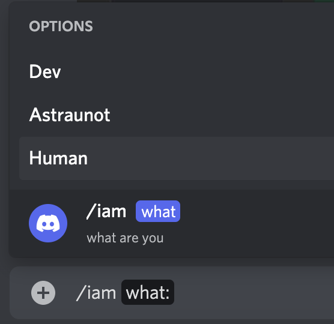

# @SlashChoice

An option of a Slash command can implement an autocompletion feature for `string` and `number` types



## Setup autocompletion

You just decorate your parameter with one or multiple @SlashChoice !

```ts
@Discord()
class DiscordBot {
  @Slash("iam")
  iam(
    @SlashChoice("Human", "human")
    @SlashChoice("Astraunot", "astro")
    @SlashChoice("Dev", "dev")
    @SlashOption("what", { description: "What are you?" })
    what: string,

    interaction: CommandInteraction
  ) {
    interaction.reply(what);
  }
}
```

## Use object or enum to define all the choices at once

```ts
enum TextChoices {
  // WhatDiscordShows = value
  Hello = "Hello",
  "Good Bye" = "GoodBye",
}

// Could be
// const textChoices = {
//   Hello: "Hello",
//   ["Good Bye"]: "GoodBye"
// }

@Discord()
class DiscordBot {
  @Slash("hello")
  @SlashGroup("text")
  hello(
    @SlashChoice(TextChoices)
    @SlashChoice("How are you", "question")
    @SlashOption("text")
    text: string,
    interaction: CommandInteraction
  ) {
    interaction.reply(text);
  }
}
```

## Signature

```ts
SlashChoice(name: string);
SlashChoice(name: number);
SlashChoice(name: string, value: number);
SlashChoice(name: string, value: string);
SlashChoice(choices: SlashChoicesType);
```

## Parameters

### Name

You have to set a diplayed name for your choice

| type             | default | required |
| ---------------- | ------- | -------- |
| string \| number |         | Yes      |

### Value

You have to set a value for your choice, if the user select "Astraunot", you will receive the value "astro"

| type             | default     | required |
| ---------------- | ----------- | -------- |
| string \| number | Choice name | No       |
