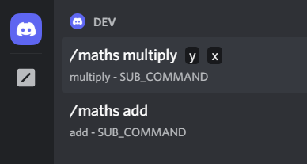
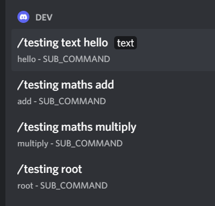

# @SlashGroup

You can group your command like this

```
command
|
|__ subcommand
|
|__ subcommand

```

```
command
|
|__ subcommand-group
    |
    |__ subcommand
|
|__ subcommand-group
    |
    |__ subcommand
```

## Example

Here you create a Slash command group that groups "permissions" commands

The permissions commands also grouped by "user" or "role"


## Create a group

We use @SlashGroup at two level, on the class and on methods

### group on class level

When @SlashGroup decorate a class it groups all the Slash commands in the class

```
maths
|
|__ add
|
|__ multiply
```

```ts
@Discord()
@SlashGroup("maths", "maths group description")
export abstract class AppDiscord {
  @Slash("add")
  add(
    @SlashOption("x", { description: "x value" })
    x: number,
    @SlashOption("y", { description: "y value" })
    y: number,
    interaction: CommandInteraction
  ) {
    interaction.reply(String(x + y));
  }

  @Slash("multiply")
  multiply(
    @SlashOption("x", { description: "x value" })
    x: number,
    @SlashOption("y", { description: "y value" })
    y: number,
    interaction: CommandInteraction
  ) {
    interaction.reply(String(x * y));
  }
}
```



### SlashGroup on method level

When @SlashGroup decorate a method it creates sub-groups inside the class group

**You have to list the groups that are in the class in the @SlashGroup parameters that decorate the class, or they will not appear**

```ts
@SlashGroup(
  "testing",
  "Testing group description",
  {
    maths: "maths group description", // Specify the groups that are in the class with th description
    text: "text group description"    // Specify the groups that are in the class with th description
  }
)
```

```
testing
|
|__ maths
    |
    |__ add
    |
    |__ multiply
|
|__ text
    |
    |__ hello
|
|__ root
```

```ts
@Discord()
@SlashGroup("testing", "Testing group description", {
  maths: "maths group description",
  text: "text group description",
})
export abstract class AppDiscord {
  @Slash("add")
  @SlashGroup("maths")
  add(
    @SlashOption("x", { description: "x value" })
    x: number,
    @SlashOption("y", { description: "y value" })
    y: number,
    interaction: CommandInteraction
  ) {
    interaction.reply(String(x + y));
  }

  @Slash("multiply")
  @SlashGroup("maths")
  multiply(
    @SlashOption("x", { description: "x value" })
    x: number,
    @SlashOption("y", { description: "y value" })
    y: number,
    interaction: CommandInteraction
  ) {
    interaction.reply(String(x * y));
  }

  @Slash("hello")
  @SlashGroup("text")
  hello(
    @SlashOption("text")
    text: string,
    interaction: CommandInteraction
  ) {
    interaction.reply(text);
  }

  @Slash("root")
  root(interaction: CommandInteraction) {
    interaction.reply("root");
  }
}
```



## Signature

```ts
SlashGroup(
  group: string,
  description: string,
  subCommands: SubCommand
): ClassMethodDecorator;
```

## Parameters

### group

`string`

The group name

### description

`string`

The group description

### subCommands

`[key: string]: string`

Define sub commands name with description, [check example here](#slashgroup-on-method-level).
