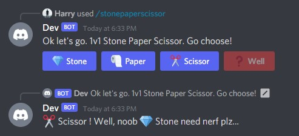

# @ButtonComponent

add button interaction handler for your bot using `@ButtonComponent` decorator

Here are some example screenshots:



## Example

```ts
import {
  ButtonInteraction,
  CommandInteraction,
  MessageButton,
  MessageActionRow,
} from "discord.js";
import { ButtonComponent, Discord, Slash } from "discordx";

@Discord()
class buttonExample {
  @Slash("hello")
  async hello(interaction: CommandInteraction) {
    await interaction.defer();

    // Create the button, giving it the ID: "hello-btn"
    const helloBtn = new MessageButton()
      .setLabel("Hello")
      .setEmoji("👋")
      .setStyle("PRIMARY")
      .setCustomId("hello-btn");

    // Create a MessageActionRow and add the button to that row.
    const row = new MessageActionRow().addComponents(helloBtn);

    interaction.editReply({
      content: "Say hello to bot",
      components: [row],
    });
  }

  // register a handler for the button with ID: "hello-btn"
  @ButtonComponent("hello-btn")
  mybtn(interaction: ButtonInteraction) {
    interaction.reply(`👋 ${interaction.member}`);
  }
}
```

## Params

`@ButtonComponent("btn-id")`

### btn-id

`string`
A unique name for your button interaction to be handled under.
