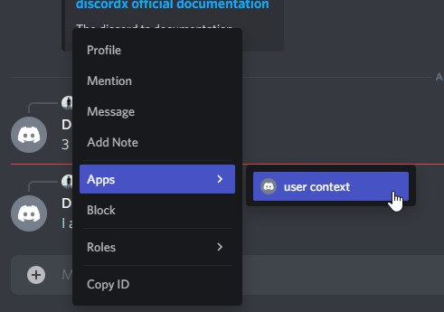
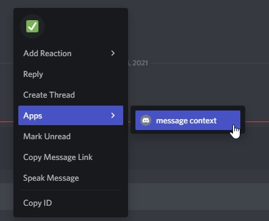

# @ContextMenu

create discord context menu options with ease!

Here are some example screenshots:




## Example

```ts
@Discord()
class Example {
  @ContextMenu("MESSAGE", "message context")
  async messageHandler(interaction: MessageContextMenuInteraction) {
    console.log("I am message");
  }

  @ContextMenu("USER", "user context")
  async userHandler(interaction: UserContextMenuInteraction) {
    console.log("I am user");
  }
}
```

## Signature

```ts
ContextMenu(
  type: "USER" | "MESSAGE",
  name?: string,
  options?: ApplicationCommandParams
)
```

## Parameters

### type

Context menu type.

| type            | default | required |
| --------------- | ------- | -------- |
| USER \| MESSAGE |         | Yes      |

### name

| type   | default | required |
| ------ | ------- | -------- |
| string | name    | Yes      |

Name of context menu. Name and handler have the same value currently.

### options

Multiple options, check below.

| type   | default   | required |
| ------ | --------- | -------- |
| object | undefined | No       |

#### `botIds`

Array of bot ids, for which only the event will be executed.

| type      | default |
| --------- | ------- |
| string[ ] | [ ]     |

#### `defaultPermission`

"You can also set a default_permission on your commands if you want them to be disabled by default when your app is added to a new guild. Setting default_permission to false will disallow anyone in a guild from using the command--even Administrators and guild owners--unless a specific overwrite is configured. It will also disable the command from being usable in DMs."

| type    | default |
| ------- | ------- |
| boolean | true    |

#### `Description`

The Slash command description

| type   | default |
| ------ | ------- |
| string | true    |

#### `Guilds`

The guilds where the command is created

| type      | default |
| --------- | ------- |
| string[ ] | [ ]     |
