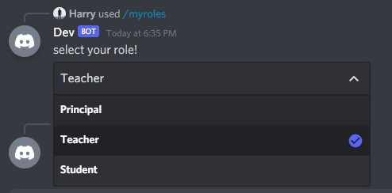

# @SelectMenuComponent

add select menu interaction handler for your bot using `@SelectMenuComponent` decorator

Here are some example screenshots:



## Example

```ts
const roles = [
  { label: "Principal", value: "principal" },
  { label: "Teacher", value: "teacher" },
  { label: "Student", value: "student" },
];

@Discord()
class buttons {
  @SelectMenuComponent("role-menu")
  async handle(interaction: SelectMenuInteraction) {
    await interaction.defer();

    // extract selected value by member
    const roleValue = interaction.values?.[0];

    // if value not found
    if (!roleValue)
      return await interaction.followUp("invalid role id, select again");
    await interaction.followUp(
      `you have selected role: ${
        roles.find((r) => r.value === roleValue).label
      }`
    );
    return;
  }

  @Slash("myroles", { description: "roles menu" })
  async myroles(interaction: CommandInteraction): Promise<unknown> {
    await interaction.defer();

    // create menu for roels
    const menu = new MessageSelectMenu()
      .addOptions(roles)
      .setCustomId("role-menu");

    // create a row for meessage actions
    const buttonRow = new MessageActionRow().addComponents(menu);

    // send it
    interaction.editReply({
      content: "select your role!",
      components: [buttonRow],
    });
    return;
  }
}
```

## Params

`@SelectMenuComponent(id: string, params?: { guilds?: Snowflake[]; botIds?: string[] )`

### id

`string`
The menu custom id for your handling menu interaction

### guilds

`Snowflake[]`

array of guild ids, the menu will execute for mentioned guild id

### botIds

`string[]`

array of bot ids, the menu will execute for mentioned bot only, useful in case of multiple bots
